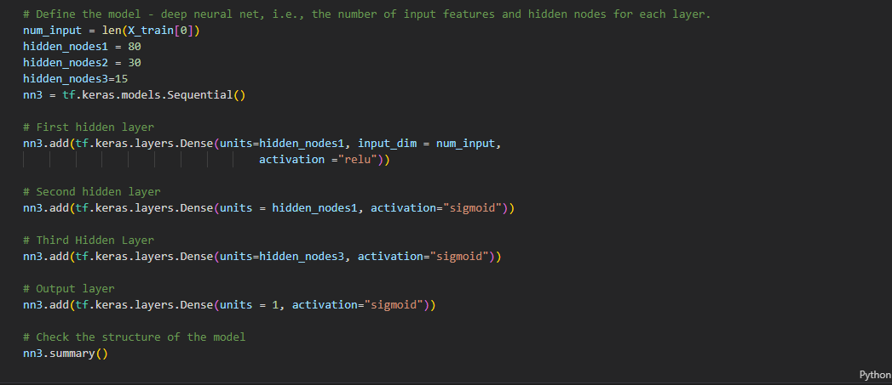

# Neural_Network_Charity_Analysis
2
​
3
## Overview
4
​
5
The purpose of this project was to use machine learning and neural networks to help a charity predict if recipients of their funding would be successful in using it to accomplish their philanthropic goals. Given a csv of over 34,000 potential organizations, a neural network in formed using Python to determine where the money should be granted. 
6
​
7
The three main steps to completing this project are as follows: 
8
​
9
- Preprocessing the data for the neural network
10
- Compile, train and evaluate the model
11
- Optimizing the model
12
​
13
## Results
14
​
15
### Data Preprocessing 
16
​
17
- The target variable was IS_SUCCESSFUL 
18
- For this model, feature variables include everything except for the following: IS_SUCCESSFUL, NAME, EIN
19
- NAME and EIN were dropped because they were deemed unnecessary for determining which organizations were most likely to be successful if granted funding
20
​
21
### Compile, Train and Evaluate the Model
22
​
23
- For this neural network model, I chose to use 3 hidden layers with 80, 30, and 15 nodes respectively. Sigmoid and relu activation were used. 
24
​
25
 
26
​
- I was only able to achieve accuracy of 72.87%, missing the goal of 75%. 
- 
27
## Summary
